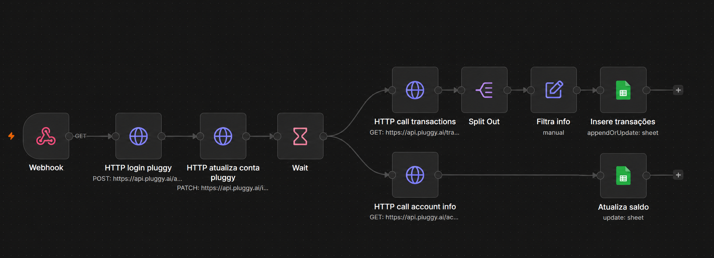
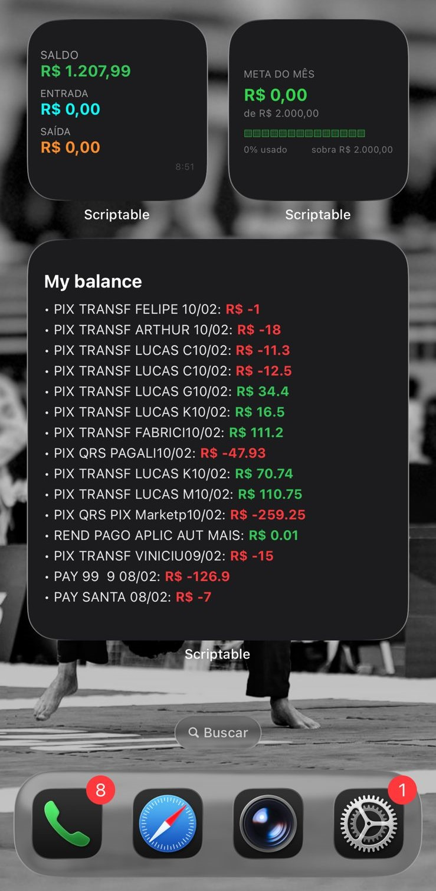

# 💰 Sistema de Organização Financeira Pessoal

Sistema completo de controle financeiro pessoal que integra dados bancários reais diretamente no iPhone. O projeto combina automação via N8N, armazenamento em Google Sheets e visualização nativa no iOS através de widgets Scriptable.

---

## 🗂️ Estrutura do Repositório

```
├── n8n/
│   └── Get dados bancários.json       # Fluxo N8N exportado (importar direto na plataforma)
│
├── scriptable/
│   ├── Saldo.js                       # Widget de saldo atual da conta
│   ├── Transações.js                  # Widget com últimas transações
│   └── Meta mensal.js                 # Widget de acompanhamento de meta mensal
│
└── assets/
    ├── fluxo_N8N.png                  # Print do fluxo N8N
    └── Resultado_Widgets.jpeg         # Preview dos widgets no iPhone
```

---

## 🏗️ Arquitetura do Sistema

```
  Banco (Pluggy API)
        │
        ▼
   Fluxo N8N  ──────────────────────────────────────┐
   (webhook + autenticação + coleta)                 │
        │                                            │
        ├──► HTTP call transactions                  │
        │         └──► Split Out                     │
        │               └──► Filtra info             │
        │                     └──► Insere transações ──► Google Sheets
        │                                            │       │
        └──► HTTP call account info                  │       │
                  └──► Atualiza saldo ───────────────┘       │
                                                             ▼
                                                     Widgets Scriptable
                                                     (iOS / iPhone)
                                                       ├─ Saldo
                                                       ├─ Transações
                                                       └─ Meta Mensal
```

---

## ⚙️ Parte 1 — Fluxo N8N

O fluxo é responsável por buscar os dados bancários via API, tratá-los e gravá-los no Google Sheets automaticamente.



### Nós do fluxo (da esquerda para direita)

| Nó | Tipo | Descrição |
|---|---|---|
| **Webhook** | Trigger | Dispara o fluxo via requisição GET externa |
| **HTTP login pluggy** | HTTP Request (POST) | Autentica na API Pluggy e obtém token de acesso |
| **HTTP atualiza conta pluggy** | HTTP Request (PATCH) | Atualiza/sincroniza os dados da conta no Pluggy |
| **Wait** | Espera | Aguarda a sincronização ser concluída antes de prosseguir |
| **HTTP call transactions** | HTTP Request (GET) | Busca o histórico de transações da conta |
| **Split Out** | Transformação | Separa o array de transações em itens individuais |
| **Filtra info** | Code (manual) | Filtra e formata os campos relevantes de cada transação |
| **Insere transações** | Google Sheets | Insere ou atualiza as transações na aba correta (appendOrUpdate) |
| **HTTP call account info** | HTTP Request (GET) | Busca informações e saldo atual da conta |
| **Atualiza saldo** | Google Sheets | Atualiza a célula de saldo na planilha (update) |

### Como importar o fluxo

1. Acesse sua instância do N8N
2. Vá em **Workflows → Import from file**
3. Selecione o arquivo `n8n/Get dados bancários.json`
4. Configure as credenciais da Pluggy API e do Google Sheets nas etapas correspondentes
5. Ative o webhook e copie a URL gerada

### Pré-requisitos N8N

- Conta na [Pluggy](https://pluggy.ai/) com uma conexão bancária ativa
- Google Sheets com as abas de transações e saldo configuradas
- Instância N8N (self-hosted ou cloud)

---

## 📱 Parte 2 — Widgets Scriptable (iOS)

Os widgets são scripts JavaScript executados pelo app [Scriptable](https://scriptable.app/) no iPhone. Eles leem os dados diretamente do Google Sheets e exibem as informações na tela inicial.

### Widgets disponíveis

#### `Saldo.js`
Exibe o saldo atual da conta bancária, entradas e saídas do dia, atualizado a cada execução do fluxo N8N.

#### `Transações.js`
Lista as últimas transações registradas, com descrição, data e valor (vermelho para débitos, verde para créditos).

#### `Meta mensal.js`
Acompanha o progresso em relação a uma meta de gastos definida para o mês, com barra de progresso e percentual utilizado.

### Como configurar os widgets

1. Instale o app **Scriptable** na App Store
2. Copie o conteúdo de cada arquivo `.js` para um novo script dentro do Scriptable
3. Em cada script, configure a URL da sua planilha Google Sheets publicada (planilha → Arquivo → Publicar na web → CSV)
4. Adicione o widget desejado na tela inicial do iPhone (pressione e segure → `+` → Scriptable)
5. Selecione o script correspondente ao widget

### Preview



---

## 🔗 Tecnologias utilizadas

| Tecnologia | Função |
|---|---|
| [N8N](https://n8n.io/) | Orquestração e automação do fluxo de dados |
| [Pluggy API](https://pluggy.ai/) | Conexão open finance com o banco |
| [Google Sheets](https://sheets.google.com/) | Banco de dados intermediário |
| [Scriptable](https://scriptable.app/) | Renderização dos widgets no iOS |
| JavaScript | Lógica dos widgets |

---

## 🔒 Segurança

- As credenciais da Pluggy API e do Google Sheets **não estão incluídas** neste repositório
- Configure-as diretamente nas credenciais do N8N e nas variáveis dos scripts Scriptable
- Nunca exponha seu `clientId`, `clientSecret` ou tokens de acesso publicamente

---

## 👤 Autor

**Felipe Pipelmo**  
Estudante de Engenharia de Controle e Automação — focado em Automação de Processos, Engenharia de Dados e Integrações de APIs.

[GitHub](https://github.com/FelipePipelmo)
