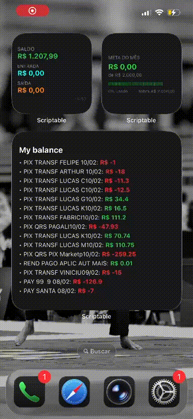

# 💰 Sistema de Organização Financeira Pessoal

Sistema completo de controle financeiro pessoal que integra dados bancários reais diretamente no iPhone e no terminal. O projeto combina automação via N8N, armazenamento em Google Sheets, visualização nativa no iOS através de widgets Scriptable e um bot CLI em Python para controle de divisões financeiras entre pessoas.

---

## 🗂️ Estrutura do Repositório

```bash
├── N8N/
│   └── Get dados bancários.json          # Fluxo N8N exportado
│
├── Scriptable/
│   ├── Saldo.js                          # Widget de saldo atual da conta
│   ├── Transações.js                     # Widget com últimas transações
│   ├── Meta mensal.js                    # Widget de acompanhamento da meta mensal
│   └── Pendências.js                     # Widget de resumo das pendências entre pessoas
│
├── bot pendencias/
│   ├── bot_pendencias.py                 # Bot CLI de controle de dívidas entre pessoas
│   ├── credentials.json                  # Credenciais da Service Account — não versionar
│   └── pendencias.db                     # Banco SQLite gerado automaticamente
│
└── assets/
    ├── fluxo_N8N.png                     # Print do fluxo N8N
    └── Resultado_Widgets.gif             # GIF demonstrando os 4 widgets no iPhone
```

---

## 🏗️ Arquitetura do Sistema

```text
Banco (Pluggy API)
      │
      ▼
 Fluxo N8N  ──────────────────────────────────────┐
 (webhook + autenticação + coleta)                 │
      │                                            │
      ├──► HTTP call transactions                  │
      │         └──► Split Out                     │
      │               └──► Filtra info             │
      │                     └──► Insere transações ──► Google Sheets ◄──── Bot Pendências
      │                                            │       │                    │
      └──► HTTP call account info                  │       │            Lê PIX novos
                └──► Atualiza saldo ───────────────┘       │            Escreve Página2
                                                           ▼
                                                   Widgets Scriptable
                                                   (iOS / iPhone)
                                                     ├─ Saldo
                                                     ├─ Transações
                                                     ├─ Meta Mensal
                                                     └─ Pendências
```

---

## ⚙️ Parte 1 — Fluxo N8N

O fluxo é responsável por buscar os dados bancários via API, tratar as informações e gravá-las automaticamente no Google Sheets.

### Nós do fluxo

| Nó                             | Tipo                 | Descrição                                               |
| ------------------------------ | -------------------- | ------------------------------------------------------- |
| **Webhook**                    | Trigger              | Dispara o fluxo via requisição GET externa              |
| **HTTP login pluggy**          | HTTP Request — POST  | Autentica na API Pluggy e obtém token de acesso         |
| **HTTP atualiza conta pluggy** | HTTP Request — PATCH | Atualiza e sincroniza os dados da conta no Pluggy       |
| **Wait**                       | Espera               | Aguarda a sincronização antes de continuar              |
| **HTTP call transactions**     | HTTP Request — GET   | Busca o histórico de transações da conta                |
| **Split Out**                  | Transformação        | Separa o array de transações em itens individuais       |
| **Filtra info**                | Code                 | Filtra e formata os campos relevantes de cada transação |
| **Insere transações**          | Google Sheets        | Insere ou atualiza as transações na planilha            |
| **HTTP call account info**     | HTTP Request — GET   | Busca as informações da conta e o saldo atual           |
| **Atualiza saldo**             | Google Sheets        | Atualiza o saldo na planilha                            |

### Como importar o fluxo

1. Acesse sua instância do N8N
2. Vá em **Workflows → Import from file**
3. Selecione o arquivo `N8N/Get dados bancários.json`
4. Configure as credenciais da Pluggy API e do Google Sheets nos nós correspondentes
5. Ative o webhook e copie a URL gerada

### Pré-requisitos N8N

* Conta na [Pluggy](https://pluggy.ai/) com conexão bancária ativa
* Google Sheets configurado com as abas usadas pelo sistema
* Instância N8N, self-hosted ou cloud
* Credenciais da Pluggy e do Google Sheets configuradas no N8N

---

## 📱 Parte 2 — Widgets Scriptable

Os widgets são scripts JavaScript executados pelo app [Scriptable](https://scriptable.app/) no iPhone. Eles leem os dados do Google Sheets e exibem informações financeiras diretamente na tela inicial do iOS.

### Widgets disponíveis

#### `Saldo.js`

Exibe o saldo atual da conta bancária, além das entradas e saídas do dia.

#### `Transações.js`

Lista as últimas transações registradas, exibindo descrição, data e valor.

#### `Meta mensal.js`

Acompanha o progresso em relação à meta de gastos mensal, com percentual utilizado e barra de progresso.

#### `Pendências.js`

Exibe um resumo das pendências financeiras entre pessoas, com base nos dados gerados pelo bot na `Página2` do Google Sheets.

### Como configurar os widgets

1. Instale o app **Scriptable** na App Store
2. Copie o conteúdo de cada arquivo `.js` da pasta `Scriptable/`
3. Crie um novo script dentro do Scriptable para cada widget
4. Configure, em cada script, a URL da planilha Google Sheets publicada como CSV
5. Adicione um widget Scriptable na tela inicial do iPhone
6. Selecione o script correspondente ao widget desejado

### Preview dos widgets


---

## 🤖 Parte 3 — Bot de Pendências

Bot de terminal em Python para controle de dívidas, divisões financeiras e pendências entre pessoas. Ele se integra ao mesmo Google Sheets usado pelo sistema, lendo transações PIX automaticamente e sincronizando o resumo das pendências em uma aba dedicada.

### Funcionalidades

* Cadastro de pessoas
* Registro manual de gastos compartilhados
* Divisão automática de valores
* Leitura de transações PIX do Google Sheets
* Detecção do nome da pessoa pela descrição da transação
* Opções para abater dívida, registrar novo gasto ou ignorar PIX
* Cálculo de saldo líquido por pessoa
* Compensação automática entre valores positivos e negativos
* Sincronização automática do resumo de pendências na `Página2`
* Revisão semanal automática ao abrir o bot no dia e horário configurados
* Banco local SQLite gerado automaticamente
* Integração com Google Sheets via `gspread`

### Instalação

```bash
pip install gspread google-auth
python3 bot_pendencias.py
```

### Configurar acesso ao Google Sheets

O bot usa uma Service Account para ler e escrever na planilha.

1. Acesse [console.cloud.google.com](https://console.cloud.google.com)
2. Crie um projeto
3. Ative a **Google Sheets API**
4. Ative a **Google Drive API**
5. Vá em **Credenciais → Criar credenciais → Conta de serviço**
6. Gere uma chave JSON
7. Salve o arquivo como `credentials.json` dentro da pasta `bot pendencias/`
8. Abra o `credentials.json`
9. Copie o valor de `"client_email"`
10. Compartilhe sua planilha com esse e-mail como **Editor**
11. No bot, acesse **Configurações**
12. Cole o ID da planilha, que fica na URL entre `/d/` e `/edit`

### Estrutura do Google Sheets esperada

| Aba        | Conteúdo                                                           |
| ---------- | ------------------------------------------------------------------ |
| `Página 1` | Transações do banco — Data, Descrição, Valor, Categoria, Tipo e ID |
| `Página2`  | Resumo de pendências por pessoa, gerado e mantido pelo bot         |

### Agendamento semanal com cron

Para executar a revisão automaticamente, agende a execução do bot via cron:

```bash
crontab -e
```

Exemplo: toda segunda-feira às 9h.

```bash
0 9 * * 1 python3 "/caminho/completo/bot pendencias/bot_pendencias.py"
```

O dia e horário da revisão também podem ser alterados diretamente no menu **Configurações** do bot.

### Fluxo de uso típico

```text
Abrir o bot
  └── Painel mostra saldo líquido por pessoa
  └── Aviso se houver PIX novos na planilha

Opção 3 — Processar PIX do Google Sheets
  └── Bot lista cada PIX não processado
  └── Detecta o nome da pessoa pela descrição
  └── Pergunta se deseja abater dívida, registrar novo gasto ou ignorar
  └── Atualiza a Página2 automaticamente

Opção 2 — Ver detalhes / quitar
  └── Lista todas as transações abertas com IDs
  └── Permite quitar individualmente ou todas de uma vez
  └── Atualiza a Página2 automaticamente
```

---

## 🔗 Tecnologias utilizadas

| Tecnologia                                  | Função                                     |
| ------------------------------------------- | ------------------------------------------ |
| [N8N](https://n8n.io/)                      | Orquestração e automação do fluxo de dados |
| [Pluggy API](https://pluggy.ai/)            | Conexão Open Finance com o banco           |
| [Google Sheets](https://sheets.google.com/) | Banco de dados intermediário do sistema    |
| [Scriptable](https://scriptable.app/)       | Renderização dos widgets no iOS            |
| JavaScript                                  | Lógica dos widgets Scriptable              |
| Python 3                                    | Bot CLI de pendências                      |
| SQLite                                      | Banco local do bot                         |
| `gspread`                                   | Integração do bot com Google Sheets        |

---

## 🔒 Segurança

* As credenciais da Pluggy API e do Google Sheets não estão incluídas neste repositório
* Configure as credenciais da Pluggy diretamente no N8N
* Configure as URLs das planilhas diretamente nos scripts Scriptable
* O arquivo `credentials.json` da Service Account deve estar no `.gitignore`
* O banco `pendencias.db` é gerado localmente e não precisa ser versionado
* Nunca exponha `clientId`, `clientSecret`, tokens de acesso ou arquivos de credenciais publicamente

### Sugestão de `.gitignore`

```gitignore
# Credenciais
credentials.json
*.env

# Banco local
pendencias.db

# Arquivos temporários
__pycache__/
*.pyc
.DS_Store
```

---

## 👤 Autor

**Felipe Pipelmo**
Estudante de Engenharia de Controle e Automação, com foco em Automação de Processos, Engenharia de Dados e Integrações de APIs.

[GitHub](https://github.com/FelipePipelmo)
